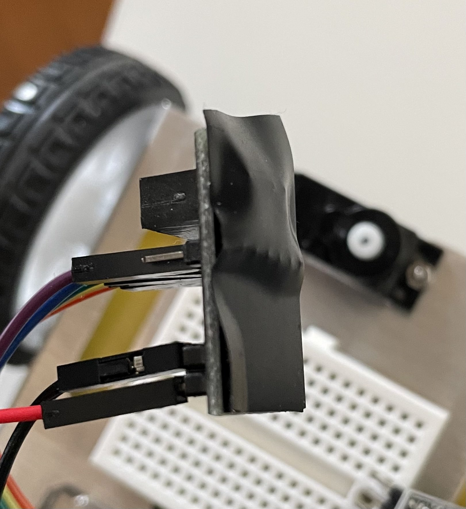
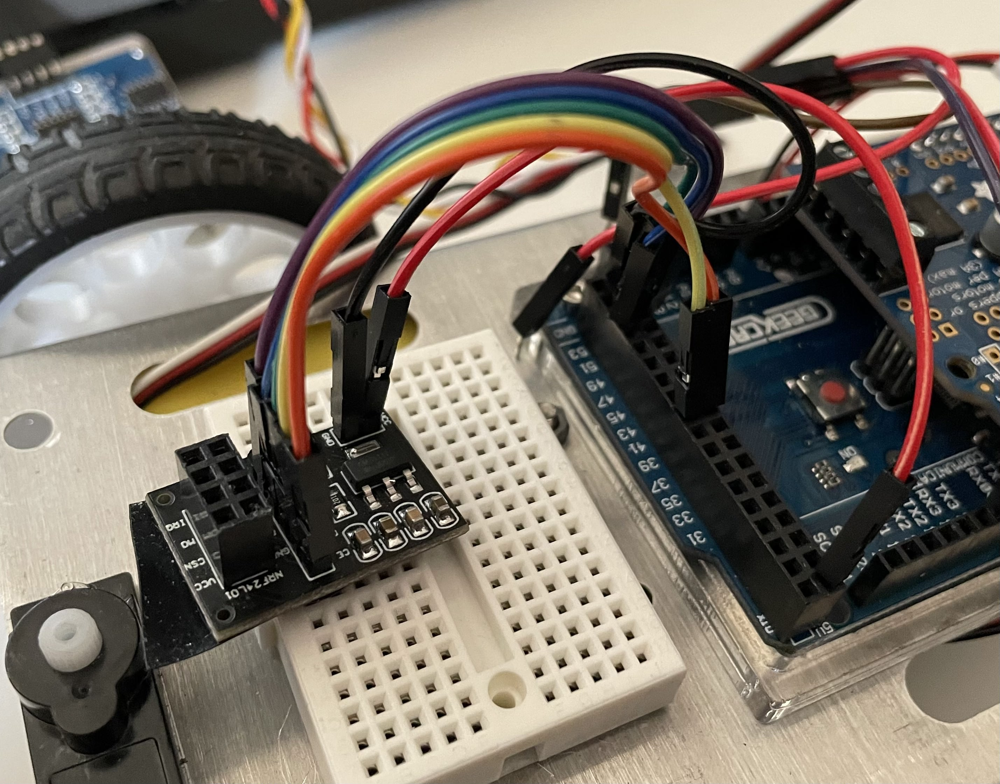
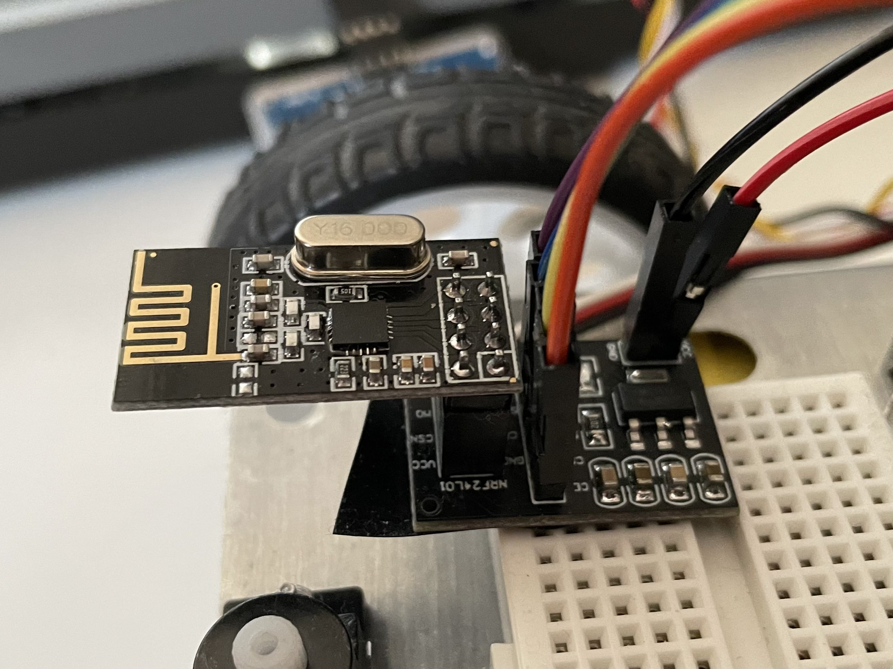

# neetam-controller
Functional nRF24L01 based RC controller and receiver, running on a Pi Pico RP2040. This currently supports telemetry with ack payloads.

### **Step 0: Requirements**
> Step 0.1: Install RF24 library via Library Manager

- RF24 library

It can installed via the Arduino IDE library manager by searching "RF24".

> Step 0.2: Clone or download this repository onto your computer

Download this repository by either cloning it or by [downloading the zip file](https://github.mit.edu/magoun/nRF24Controller/archive/master.zip) and then unzipping it.

## Getting Started with the Receiver

There are a few methods that you will use to receive information from the controller. You can look at `receiver/receiver.ino`, which is a bare minimum sketch for reference.

### **Step 1: Connecting the radio module**


*Power Adapter module (left) and the nRF24l01+ radio module (right)*


The radio should be connected to the Arduino via an SPI interface, which consists of `CLK` (clock), `COPI` (controller out, peripheral in), `CIPO` (controller in, peripheral out), and `CSN` (chip select). There is an additional pin `CE` (chip enable) which also needs to be connected to a digital output pin. If you are using a sensor shield, these pins are already wired to predefined pins, otherwise `CE` and `CSN` can be connected to any digital output pins while the other pins should be connected to the hardware SPI pins on the Arduino. 
____
This table shows the pin names and recommended connections if you are using an Arduino Mega and the nRF24 power adapter module:

_**Note: the radio is a 3.3V device, do not supply 5V to VCC if you are not using the power adapter module. The power adapter module has an onboard regulator that converts it to 3.3V**_

| Radio Pin Name | Arduino Pin Number |
| -------------- | ------------------ |
| CE | 38 |
| CSN | 39 |
| SCK | 52 |
|MO (COPI) | 51 | 
|MI (CIPO) | 50 |
|IRQ | Not connected|
|VCC | 5V (If using adapter) |
|GND | GND |

> Step 1.1: add electrical tape to power adapter module

First, put a piece of electrical tape on the bottom of the power adapter module, this prevents shorts if the module touches the mostly metalic chassis of your robot. Ideally you should also design a mount for the module that keeps it away from accidental shorts.



> Step 1.2: Wire up the power adapter module

I recommend wiring up the power adapter module first, which should look like this: 



> Step 1.3: Plug radio into power adapter module

And then you can plug the radio into the power adapter, there should only be one way that it fits.



### **Step 2: Including the file**

Like other libraries, we will use an `#include` directive to link the controller library to our code. Under the hood, the compiler will copy the content of the included file into your current file, which will then be compiled. Be careful not to redefine any of the macros in the included file, such as `CONTROLLER_RATE_HZ` or `RECEIVER_TIMEOUT_MSEC`, because it will change the behavior of the prewritten code.

Add `#include "NEET_RF24.h"` to the top of your file. Make sure that `NEET_RF24.h` and `NEET_RF24.cpp` is in the same folder as your `.ino` file so that the Arduino IDE can find it. **You may need to delete the existing `NEET_RF24` files and then copy-and-paste the files into the sketch folder if you are using Windows or Mac.**

> Step 2.1: Copy the library files into sketch folder

> Step 2.2: Add `#include "NEET_RF24.h"` to your sketch

### **Step 3: Declaring and initializing the radio object**

On top of your sketch, declare the radio object by writing these four lines:

```c++
#define NRF_CE 38
#define NRF_CSN 39
#define CHANNEL 7
NEET_RF24 radio(NRF_CE, NRF_CSN, CHANNEL);
```

>Step 3.1: Add define and declaration statements

>Step 3.2: Change `CHANNEL` to the channel of your controller

Be sure to change the `NRF_CE`, `NRF_CSN`, and `CHANNEL` to the values you are using. Your controller channel should be shown on the back cover.


*Controller with channel 7 assigned*

>Step 3.3: Call `radio.begin()` in your `setup()`

The `begin()` function should be called once in `setup()` to initialize the radio object. It will return true if the radio is sucessfully initialized.

### **Step 4: Getting values from the controller**

You should periodically call `rxUpdate()` to let the radio module process incoming data. The controller is configured to send at 100Hz so calling this function at that rate will provide the most up-to-date values from the controller. To detect disconnections from the controller, `rxUpdate()` will return if data is received from the controller in the last 100ms. You can use that return value to determine if it is safe to continue to drive/operate the robot or if it is better to halt and wait.

After calling `rxUpdate()` you can get the values from the controller by calling `rxGetInput()`. It will return a `ControlInput` struct that contains the values of the controller.

A recommended way to read and process the data is as follows: 
```c++
ControlInput input_vals; // Holds value from controller

void loop(){
    if (radio.rxUpdate()){
        input_vals = radio.rxGetInput();
        // Do things with the input
    } else {
        // Halt the robot because we've lost connection
    }
}
```

### **Step 5: Sending telemetry back**

**Note: it takes 10-30 ms to send a line of telemetry, please make sure there's enough time between telemetry messages so that nothing gets omitted because it's sent too soon**

You can also send data back to the controller to be displayed via Serial by using the `rxSendTelemetry()` function. The first argument will be a string containing the data you are sending, make sure the length of the message is below 63 characters to keep the telemetry brief and easy to end, the second argument is optional and indicates what to do if the radio is in the middle of transmitting the previous telemetry message. Setting it to true will interrupt the previous transmission, while setting it to false will discard the new telemetry. An example is below:

```c++

// Sends "Hello world!" and the content of x, success is true if the radio is free and successfully sent the message. It is false if there is already another telemetry message being sent, or if the radio can't send the message back to the controller
bool success = radio.rxSendTelemetry("Hello world! " + String(x));

// Sends a message with override enabled, this interrupts the previous telemetry transmission
radio.rxSendTelemetry("This is urgent", true);
```

### **Step 6: Reading telemetry on your computer**

You can read the telemetry by connecting the controller to your computer via a micro USB cable and opening a Serial Monitor to that port. The baud rate is 115200.


**Note: you need to install the RP2040 Core in order to read from the controller**

> Step 6.1: Install RP2040 Core to your Arduino IDE

Please follow [this guide](https://learn.adafruit.com/rp2040-arduino-with-the-earlephilhower-core?view=all#installing-the-earlephilhower-core) to install the new board to your Arduino IDE.

> Step 6.2: Select Pi Pico as your board, and the correct port

Select **Raspberry Pi Pico RP2040** in Tools -> Boards -> Raspberry Pi RP2040 Boards -> Raspberry Pi Pico and you should be able to see Telemetry from your robot!

> Step 6.3: Open Serial Monitor with baud rate of 115200.

## WIP Features
**Please let me (Tim) know if you would like additional features to the controller. It's designed to help you debug your robot more effectively and I'm happy to implement other features to help achieve that goal.**
- Send information to the robot via Serial Monitor
- Battery saving features after idle